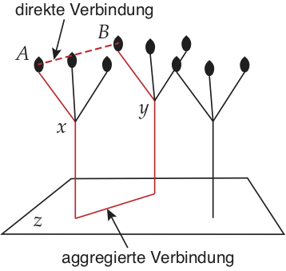
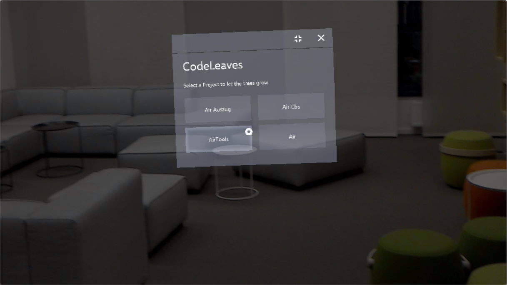
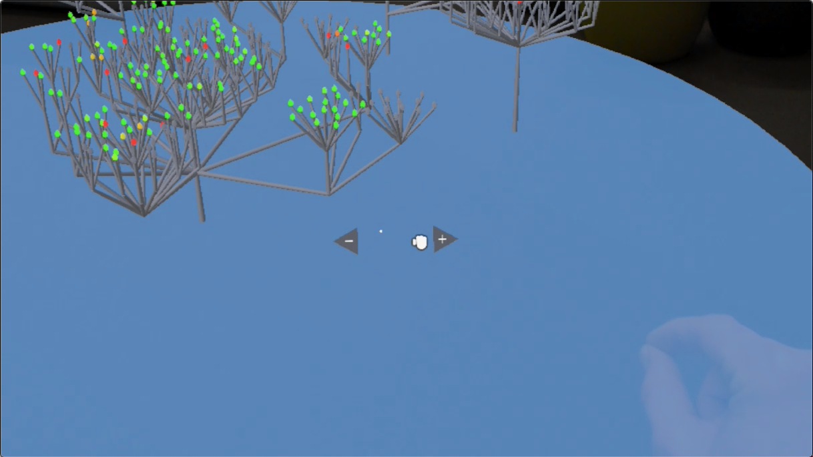
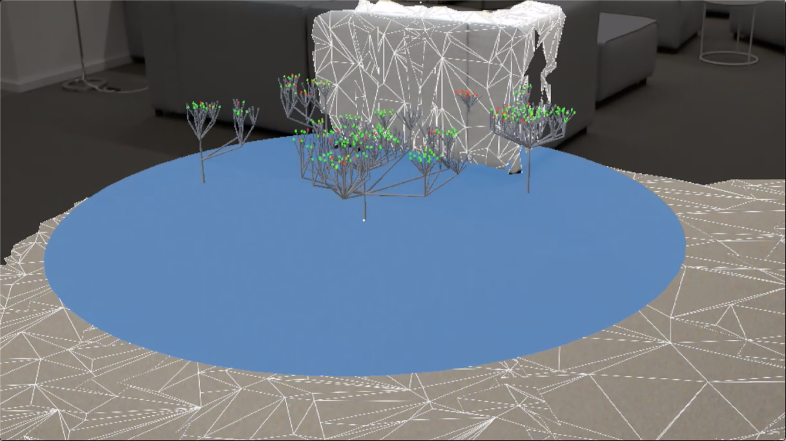
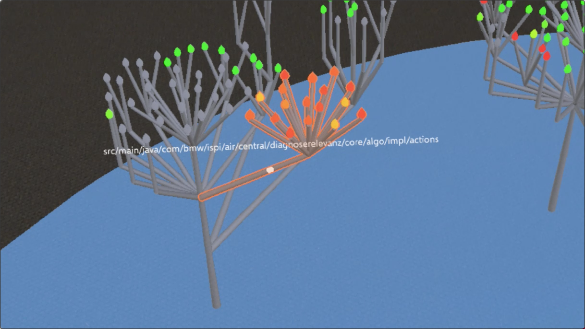
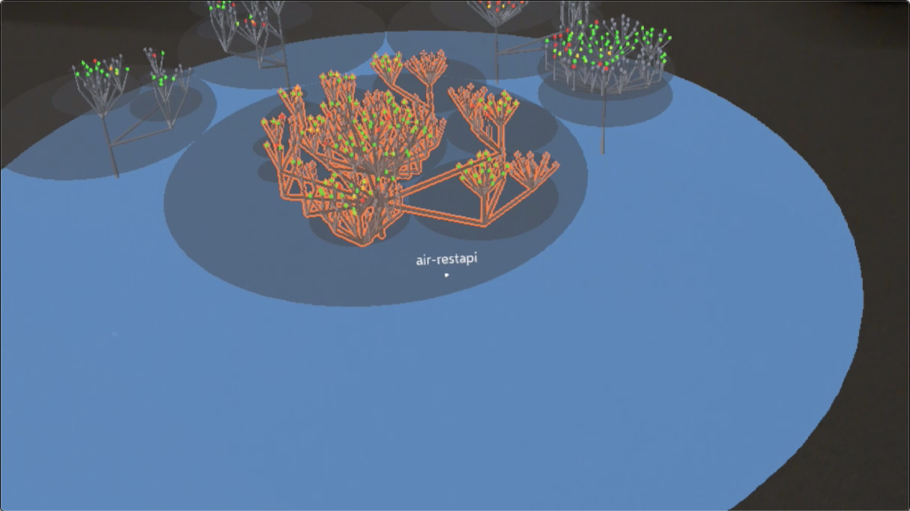

# CodeLeaves
CodeLeaves as a 3d software visualization tool for the HoloLens

### Concept
1. The structrue of a software stystem is displayed as upward growing trees
2. Packages in the root directory are trees, subpackages are branches and classes are leaves.
3. The color of the leaves can display a specific metric of the system.
4. Connections (e.g. dependencies or calls) between classes are aggregated and determine the thickness of an edge or can be displayed directly between leaves as cob webs.
5. Roots are connecting the trees and display aggregated connections between subpackes.

### Demo (Prototype)

Open a project from the menu

Scale

Place using spacial mapping

Hover to inspect elements

Activate circles for hovering from a birds view

